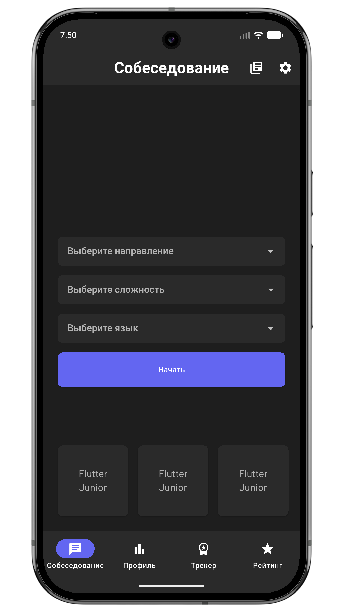
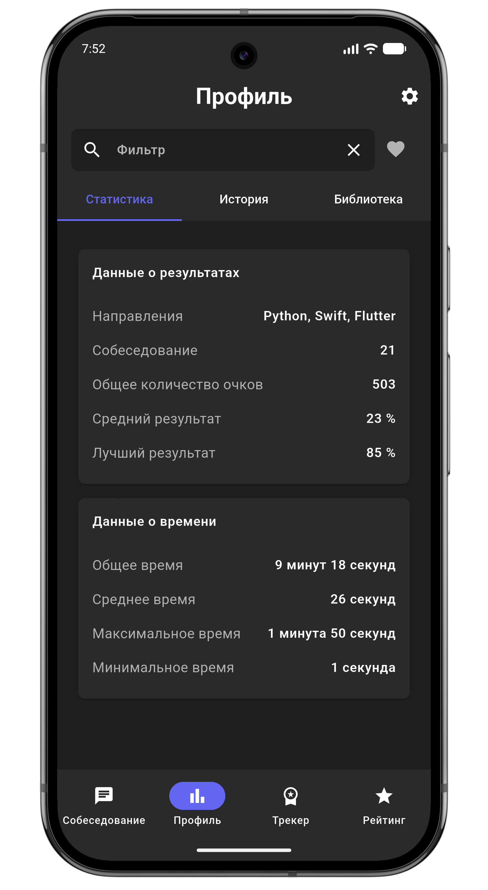
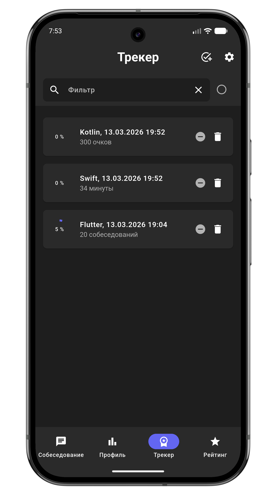
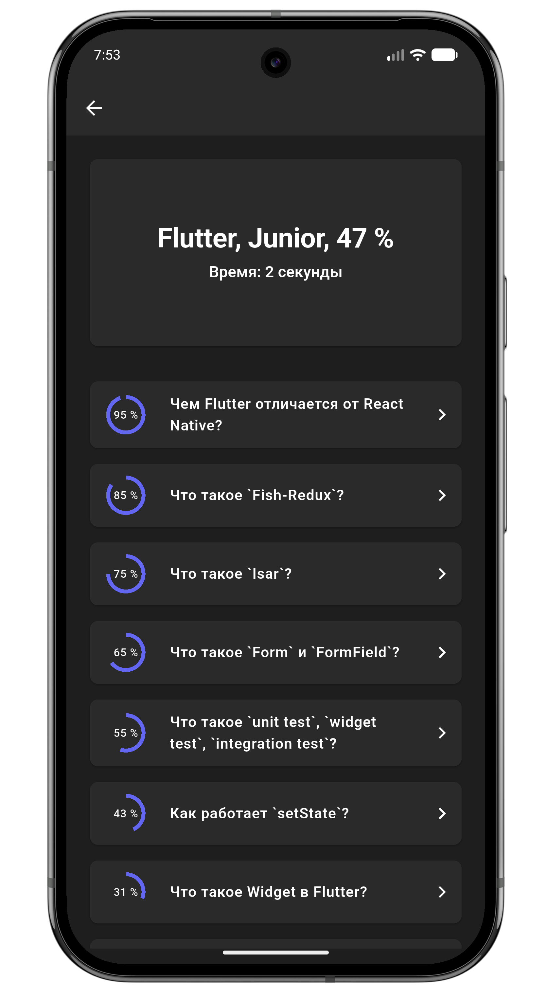

# SkiilAI

**Обучающее приложение для подготовки к IT-собеседованиям, разработанное на Flutter.**  
Приложение помогает разработчикам системно готовиться к техническим интервью, изучать популярные вопросы и проверять свои знания.

SkiilAI содержит большую базу вопросов по различным технологиям и позволяет отслеживать прогресс обучения. Пользователи могут тренироваться, анализировать результаты и сравнивать свой уровень подготовки с другими разработчиками.

Подходит как начинающим разработчикам, готовящимся к первому интервью, так и более опытным специалистам, которые хотят освежить знания и подготовиться к следующему карьерному шагу.

---

## 🚀 Функционал

✨ Основные возможности:

- 📚 База из **4000+ вопросов** по более чем **10 IT-технологиям**
- 💡 Подробные ответы и объяснения к каждому вопросу
- 📊 Отслеживание прогресса обучения
- 🏆 Система рейтинга и сравнение результатов с другими пользователями
- 🎯 Системная подготовка к техническим интервью
- 🔎 Удобная навигация и быстрый поиск вопросов
- 🎤 Голосовые функции (озвучивание и распознавание)

---

## 📱 Платформы

- Android  
- iOS

---

## 🛠️ Технологии

- **Flutter / Dart**
- **Bloc** — управление состоянием
- **GoRouter** — навигация
- **Dio** — работа с API
- **Firebase**
  - Authentication
  - Cloud Firestore
- **Hive** — локальное хранилище
- **Speech To Text** — распознавание речи
- **Flutter TTS** — озвучивание текста
- **Talker** — логирование
- **SharedPreferences** — локальные настройки

---

## 📲 Скачать приложение

Приложение доступно в RuStore:

https://www.rustore.ru/catalog/app/com.example.interview_master

---

## 📂 Установка и запуск

1️⃣ Клонирование репозитория

```bash
git clone https://github.com/username/interview-helper.git
cd interview-helper
```

2️⃣ Установка зависимостей

```bash
flutter pub get
```

3️⃣ Запуск проекта

```bash
flutter run
```

## 📌 Структура проекта

```bash
lib/
├── main.dart
├── app/
│   ├── app_runner/
│   ├── router/
│   ├── widgets/
│   └── app.dart
├── core/
│   ├── constants/
│   ├── theme/
│   └── utils/
├── data/
│   ├── data_sources/
│   ├── enums/
│   ├── models/
│   └── repositories/
├── features/
│   ├── auth/
│   ├── home/
│   ├── interview/
│   ├── profile/
│   ├── tracker/
│   └── users/
├── generated/
└── l10n/
```

---

   
